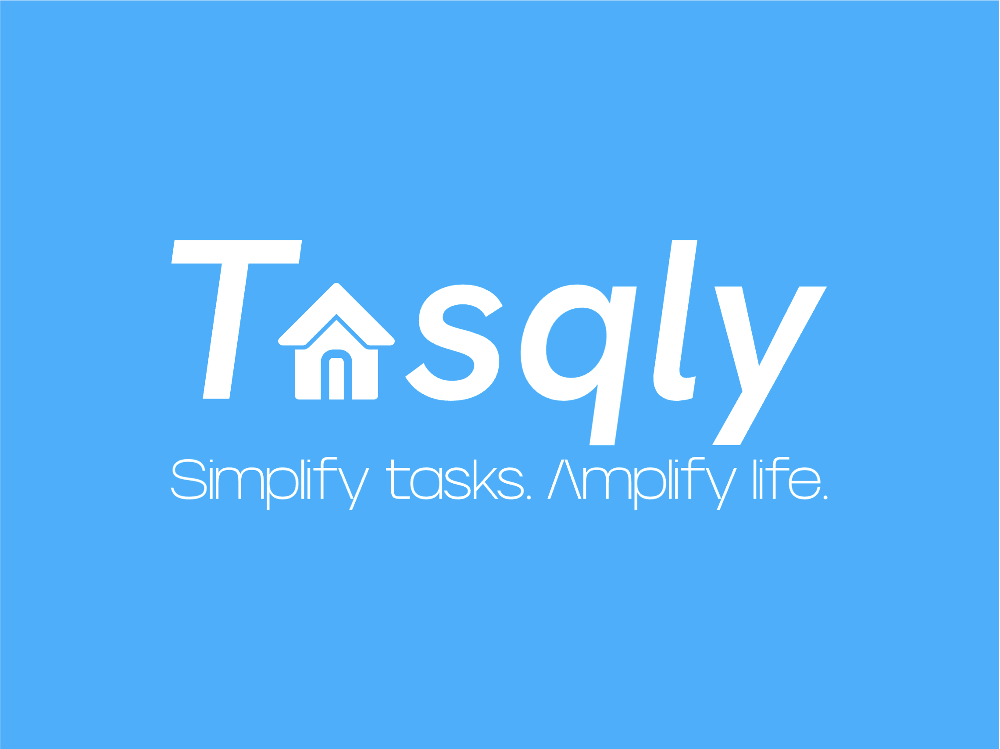
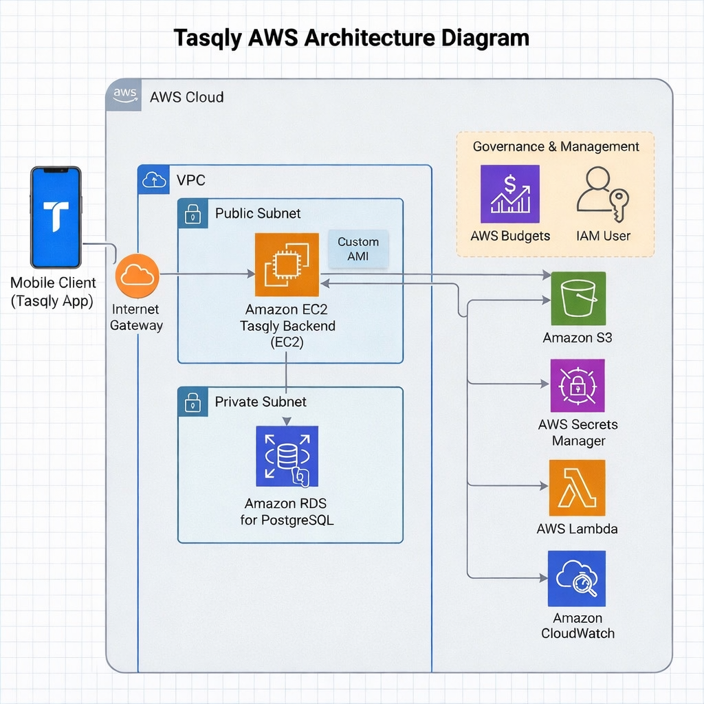

# ☁️ Tasqly Cloud Documentation

## 📌 Cloud Diagram

---

## 1) Overview & Goals

Tasqly is a mobile application for shared households. It supports task management, landlord requests, and media uploads.

This cloud setup is designed to:

- follow real-world AWS architecture practices
- stay readable and manageable for a student project
- start with free-tier-eligible or credit-covered services where possible
- scale only when usage or performance requires it
- use managed services where they add clear value

This document focuses only on the main AWS cloud components that make up the solution and that will appear in the architecture diagram.

---

## 2) Design Principles

- **Minimum by default**: only the components needed for the first working version
- **Least privilege**: each user, service, and resource gets only the access it needs
- **Private where possible**: sensitive services such as the database are not publicly exposed
- **Cost-aware**: begin with free tier or credits where applicable, then scale gradually
- **Managed where it matters**: use a managed PostgreSQL service instead of self-hosting the database
- **Simple networking**: one VPC, minimal subnets, minimal open ports

---

## 3) High-Level Cloud Architecture

The Tasqly cloud environment is built on AWS.

At a high level:

- the mobile client sends requests to the backend over HTTPS
- the backend runs on a single Amazon EC2 Linux instance
- the EC2 instance is launched from a custom AMI
- backend container images are stored in Amazon ECR
- application data is stored in Amazon RDS for PostgreSQL
- uploaded files such as receipts and issue photos are stored in Amazon S3
- secrets are stored in AWS Secrets Manager
- lightweight asynchronous processing such as email-related actions can run in AWS Lambda
- monitoring and logs are handled through Amazon CloudWatch
- cost monitoring is handled through AWS Budgets

---

## 4) AWS Environment Scope

Tasqly will use a single AWS environment in one primary region:

- **Region:** `ca-central-1`

All resources will be consistently tagged for management and visibility.

Suggested tags:

- `Project=tasqly`
- `Environment=prod`
- `Owner=josue`
- `ManagedBy=terraform`

---

## 5) Cloud Components

### 5.1 IAM User

Tasqly will use a dedicated **IAM user** for project infrastructure operations.

Approach:

- separate project access from the root account
- enable MFA
- start with minimum required permissions
- add permissions only when needed

This user will manage Tasqly AWS resources while following least-privilege access.

### 5.2 Amazon VPC

Tasqly runs inside a single **Amazon VPC**. The VPC acts as the main network boundary for the solution.

Its purpose is to:

- isolate Tasqly resources
- define subnet placement
- control routing
- support security groups and private/public separation

### 5.3 Public Subnet

A **public subnet** is used only for the application entry point.

It contains the public-facing application layer that must receive inbound internet traffic from the mobile client.

Its role is to:

- expose the application to the internet
- allow controlled inbound HTTPS access
- keep the public surface area limited to the application path only

### 5.4 Private Subnets

**Private subnets** are used for the rest of the internal infrastructure.

Everything should remain private except the application path that must be exposed to the internet.

These private subnets are used for components such as:

- the PostgreSQL database
- internal application-side resources
- other non-public infrastructure components

Their role is to:

- keep internal services off the public internet
- reduce exposure of sensitive resources
- support a cleaner and safer network design

### 5.5 Internet Gateway

An **Internet Gateway** is attached to the VPC to allow internet connectivity for the public-facing application path.

It is required for:

- inbound access to the application entry point
- approved outbound access from the public application layer

Internal resources remain in private subnets and are not directly exposed to the internet.

### 5.6 Route Tables

**Route tables** control how traffic moves between the internet, the public subnet, and the private subnets.

They are used to keep public traffic and private traffic separated while keeping the network design minimal.

### 5.7 Security Groups

**Security groups** act as virtual firewalls for Tasqly resources.

They enforce minimum required access:

- allow only required application ports to the public-facing application side
- allow PostgreSQL access only from approved application-side resources
- keep all unnecessary ports closed

### 5.8 Amazon EC2

Tasqly uses a single **Amazon EC2 Linux instance** as the main application compute host.

Its role is to:

- run the backend application platform
- act as the main runtime entry point
- keep the infrastructure small and cost-aware in the first phase

### 5.9 Custom AMI

The EC2 instance is launched from a **custom Amazon Machine Image (AMI)**.

The AMI contains the base operating system and required platform tooling so the instance starts from a prepared baseline instead of being configured from scratch every time.

### 5.10 Amazon ECR

**Amazon Elastic Container Registry (ECR)** stores the backend container images.

Its role is to:

- keep versioned application images in AWS
- provide a central source for deployment images
- allow controlled image access from the runtime environment

### 5.11 Amazon RDS for PostgreSQL

Tasqly uses **Amazon RDS for PostgreSQL** as its managed relational database service.

It stores core application data such as:

- users
- households
- tasks
- landlord requests
- metadata for uploaded files

Tasqly will begin with the smallest free-tier-eligible or credit-covered PostgreSQL setup where possible, and only scale the database when real usage or performance requires it.

### 5.12 Amazon S3

**Amazon S3** is used for object storage.

It stores uploaded files such as:

- landlord issue photos
- receipts
- other application media

The database stores object references and metadata, while the actual files are stored in S3.

### 5.13 AWS Secrets Manager

**AWS Secrets Manager** is used to store sensitive values securely.

Examples include:

- database credentials
- application secrets
- integration credentials

### 5.14 AWS Lambda

**AWS Lambda** is used for small asynchronous or event-driven tasks.

For Tasqly, this can include:

- email-related actions
- lightweight background processing
- simple event-triggered automation

### 5.15 Amazon CloudWatch

**Amazon CloudWatch** is used for logs, basic monitoring, and alerts.

Its role is to:

- collect warnings and error logs from the environment
- support basic health visibility
- enable lightweight alerting for important failures

To reduce cost, logging should exclude lower-value log levels such as **info** and **debug** where practical.

### 5.16 AWS Budgets

**AWS Budgets** is used for cost visibility and budget control.

Tasqly follows a **free-tier-first** cost strategy:

- start with AWS Free Tier or available AWS credits wherever applicable
- use the smallest practical resource sizes by default
- increase capacity only when real usage, reliability, or performance requires it
- delay consuming the initial budget as much as possible

Budget levels for the project:

- **Target monthly spend:** `0–20 USD`
- **Monthly watch threshold:** `25 USD`
- **Warning threshold:** `40 USD`
- **Critical threshold:** `60 USD`
- **Total starting budget target:** `100 USD`

This structure means:

- `0–20 USD` = expected starter range
- `25 USD` = keep an eye on usage
- `40 USD` = warning zone, review resources and spending
- `60 USD` = critical zone, spending is too high for the current phase
- `100 USD` = total budget baseline that should last as long as possible

The current cost strategy is to begin with free-tier-eligible or credit-covered services wherever possible, including the PostgreSQL database, and increase capacity only when there is a clear need.

---

## 6) Security Baseline

Tasqly uses a minimal, efficient, and cost-effective security approach.

Core decisions:

- least-privilege access
- private database and internal resources
- secrets stored in AWS Secrets Manager
- minimum required network exposure
- no hardcoded credentials

---

## 7) Networking Baseline

Tasqly uses a minimal, efficient, and cost-effective networking design.

Recommended baseline:

- **1 VPC**
- **1 public subnet** for the application entry point
- **private subnets** for the rest of the infrastructure
- **1 Internet Gateway**
- **route tables** to separate public and private traffic
- **security groups** with minimum required rules

The application is the only internet-exposed path. Everything else stays private.

---

## 8) Cloud Component Relationships

At a high level, the cloud components interact like this:

1. The **mobile client** sends requests to the backend over HTTPS.
2. The application entry point is exposed through the **public subnet**.
3. The backend runs on the **EC2 instance**.
4. The backend retrieves its container images from **Amazon ECR**.
5. The backend reads sensitive configuration from **AWS Secrets Manager**.
6. The backend stores relational data in **Amazon RDS for PostgreSQL**.
7. Uploaded files are stored in **Amazon S3**.
8. Small asynchronous tasks can be handled by **AWS Lambda**.
9. Warnings and errors are sent to **Amazon CloudWatch**.
10. Project spending is tracked through **AWS Budgets**.

---

## 9) Diagram Scope

The cloud diagram should visually include these AWS components:

- Mobile client
- IAM user
- Amazon VPC
- Public subnet
- Private subnets
- Internet Gateway
- Route tables
- Security groups
- Amazon EC2
- Custom AMI
- Amazon ECR
- Amazon RDS for PostgreSQL
- Amazon S3
- AWS Secrets Manager
- AWS Lambda
- Amazon CloudWatch
- AWS Budgets

This document intentionally leaves out the internal implementation details of Kubernetes, Terraform, and GitHub Actions. Those will be documented separately.