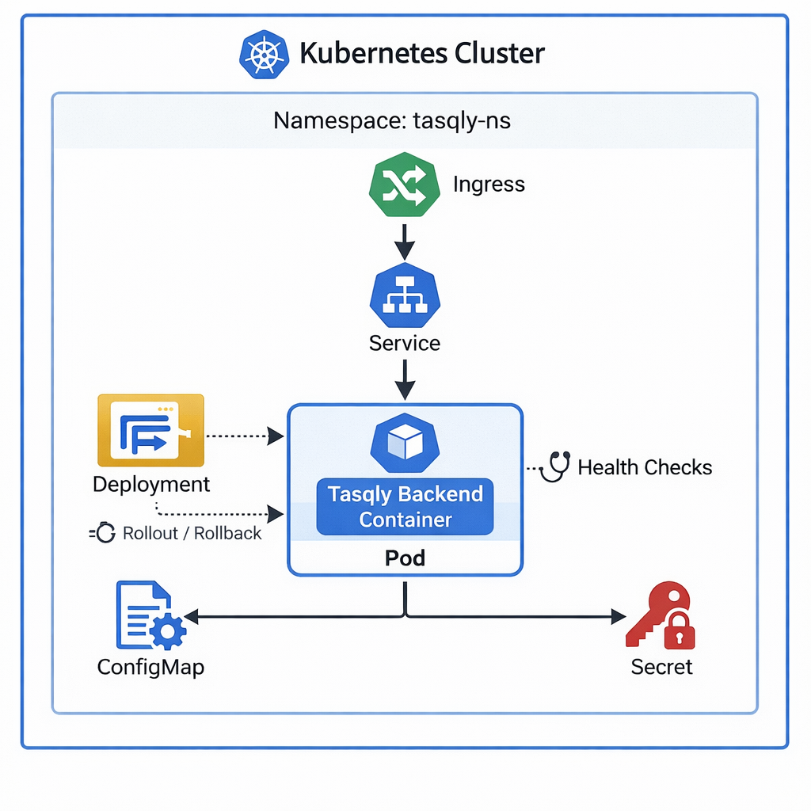

# ☸️ Tasqly Kubernetes Documentation

# Architecture Diagram

## 1) Overview

Tasqly uses **Kubernetes** to run and manage the backend application container.

The goal is to keep the runtime environment:

- structured
- easier to manage
- capable of controlled rollout and rollback
- aligned with container-based deployment practices

Kubernetes is used as the application orchestration layer for the Tasqly backend.

---

## 2) Purpose

Kubernetes is used to:

- run the backend container in a managed way
- restart the application if it fails
- expose the application through a stable network path
- support controlled deployments and rollbacks
- separate runtime configuration from the container image

This provides a cleaner and more maintainable runtime model than managing containers manually.

---

## 3) Scope

For Tasqly, Kubernetes is responsible for the backend application runtime.

This includes:

- backend deployment
- pod management
- service exposure
- ingress-based access
- configuration injection
- secret consumption
- rollout and rollback behavior
- health checks

This documentation focuses on the Kubernetes role in the project, not on cluster installation details.

---

## 4) Core Components

### 4.1 Pod

A **Pod** is the smallest deployable unit in Kubernetes.

For Tasqly, the backend container runs inside a pod.

Its role is to provide the running environment for the application container.

### 4.2 Deployment

A **Deployment** manages the backend pods.

It is used to define:

- which image runs
- how many replicas should run
- how updates happen
- how failed pods are replaced

This is the main Kubernetes resource used to run the Tasqly backend.

### 4.3 Service

A **Service** provides stable internal access to the backend pods.

Because pods can be recreated and change IP addresses, the service gives the application a consistent internal network entry point.

### 4.4 Ingress

An **Ingress** exposes the application through an HTTP or HTTPS entry path.

For Tasqly, ingress is used to route external traffic to the backend service.

### 4.5 ConfigMap

A **ConfigMap** stores non-sensitive application configuration.

Examples include:

- app configuration values
- environment-specific settings
- non-secret runtime options

This keeps configuration outside the container image.

### 4.6 Secret

A **Secret** stores sensitive values required by the application at runtime.

Examples include:

- database connection credentials
- application secret values
- integration credentials

This allows sensitive configuration to be handled separately from the application image.

### 4.7 Namespace

A **Namespace** is used to organize Kubernetes resources.

For Tasqly, this helps keep the application resources grouped and easier to manage.

---

## 5) Runtime Flow

At a high level, the Kubernetes runtime works like this:

1. The backend container image is deployed through a **Deployment**.
2. Kubernetes creates and manages the required **Pods**.
3. A **Service** exposes the pods internally.
4. An **Ingress** routes external traffic to the service.
5. The application reads runtime configuration from **ConfigMaps** and **Secrets**.
6. Kubernetes monitors pod health and restarts failed containers when needed.

---

## 6) Rollout and Rollback

Kubernetes supports controlled application updates.

For Tasqly, this means:

- new versions can be rolled out gradually
- failed versions can be rolled back
- the application can return to the previous working version if the new one does not run correctly

This is one of the main reasons Kubernetes is useful in the project.

---

## 7) Health Management

Kubernetes helps keep the application healthy by monitoring it during runtime.

The backend should expose health endpoints so Kubernetes can:

- check whether the application is running
- check whether the application is ready to receive traffic
- restart the container if it becomes unhealthy

This improves runtime reliability.

---

## 8) Summary

Kubernetes is the runtime orchestration layer for Tasqly.

It manages the backend container, exposes it through a stable network path, supports controlled updates and rollback, and helps keep the application running reliably.